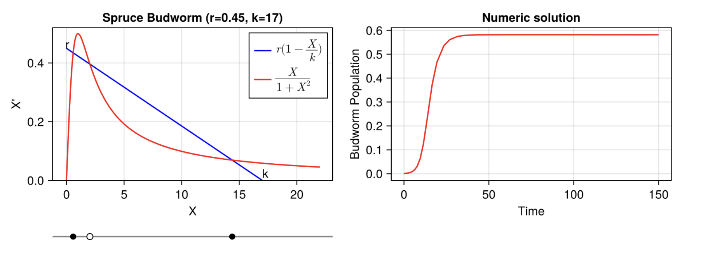
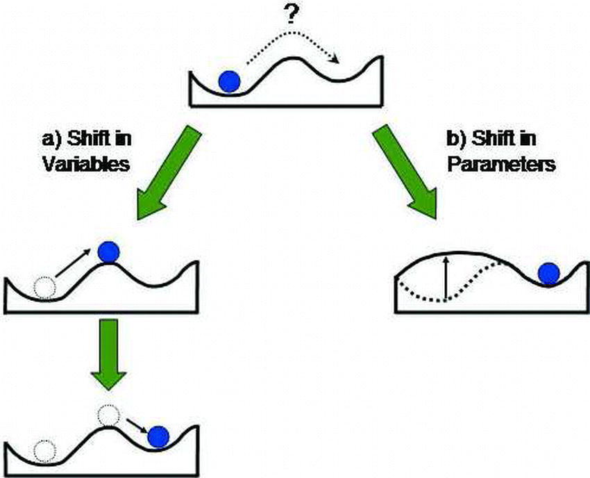

---
sql:
    data: hysteresis-data.parquet
    tradeoffData: tradeoff.parquet
---

# Hysteresis

## In ecology

In ecology, alternative stable states are important because they can lead to drastic changes in the ecosystem even with small perturbations, which cannot be undone easily. 

The classical example is that of turbidity in shallow lakes, in response to excess level of nutrients (like phosphate). Something like

```tex
\dot{X} = \frac{a + X^2}{1+X^2} - rX
```

where _X_ is the ecosystem state (turbidity of the lake), while _r_ is the parameter condition (like nutrients). As you add more nutrients, nothing might happen for a while to the state of the lake. But as you hit a critical threshold, you bifurcate to a new fixed point of turbidity that is much higher than the previous one ('catastrophe' event). Unfortunately, as the story goes, to get get back to your favored equilibrium you need to remove much more nutrients from the lake than what has been allowed before. It might look like 


Try explaining that to farmers than the previous allowed level of nutrients is too much now.

This example has a a single parameter _r_. In the next example popularized by Strogatz, we have the outbreak of spruce budworms in forest, which the nondimensional version looks like

```tex
\dot{X} = rX(1 - \frac{X}{K}) - \frac{X^2}{1+X^2}
```

Here, the removal of the spruce budworms _X_ is a nonlinear term, wheras the growth rate takes a logistic form with growth rate _r_ and a carrying capacity _K_. For specific value of _K_ and _r_, we might have something like



Then, with some algebra, Strogatz show that we have hysteresis in this 2d systems 


To see how the pair of parameters _r_ and _k_ impact the ecosystem, you now need a 3d plot (plot borrowed from Garfinkel et al. 2021):


The management story here is that if you want to get from outbreak to refugee only, you could either drastically reduce _r_ (good luck with that) or perhaps reduce a little bit _k_ and _r_ (get into the bistable region, black star), then reduce _X_ (by spraying insecticides; white star). With this strategy, the system could go back by itself in the low-X equilibrium state (red star).

In both cases, we have a single state variable driven by one or more condition parameters. In the first case, the import of nutrients is nonlinear, with the removal being linear. In the second case, we end up with the removal being nonlinear (and not dependent on any parameter), while the reproduction rate is linear. 

In ecology, there are two ways by which alternative stable states are thought to happen; either by a shift in parameters shift, or in state variables.



The key differences are part of cultural differences in ecology:

- `community perspective`: shift in state variables (pushing a ball over a hill; landscape is broadly constant), e.g.
  - alternative interior states (predator removal or additions, Overharvesting a fishery)
  - boundary states where one or more species is absent (interspecific competition is stronger than intraspecific competition, one population will outcompete the other, Dispersal and colonization)
- `ecosystem perspective`: shift in parameters (changing the underlying landscape)


As mentionned by Giulio, we should also note that all previous examples have fixed points that are solutions of a third order equation:

```tex
ax^3+bx^2+cx+d=0
```

And the thing, as he say, is that you cannot get hysteresis with an equation of a lower order.

## In humanities?

_Intuitively (or naively), our small perturbations here would be that we increase the benefits to code which cannot be undone easily. Assume that the context is that humanities start valuing way too much 'computational approach' at the expense of domain expertise. Say that in philosophy, a hiring committee could  favor of someone who know a fair bit of programming over someone who has deep knowledge of Plato, but know nothing of programming. In this story, X is number of programmers in the system, while b is the parameter condition (like benefits to learn coding). As you add more benefits, nothing might happen for a while to the state of the system. But as you hit a critical threshold, you bifurcate to a new fixed point of programmers that is much higher than the previous one ('catastrophe' event). Unfortunately, as the story goes, to get get back to your favored equilibrium you need to 'remove' much more benefit (say by increasing the benefit of non-programmers) from the system than what has been allowed before._

All that being said, right now we don't have a third order expression. So it won't work. 

Here's the raw data

```sql id=[...betaData]
WITH ranked_data AS (
    SELECT 
        d.beta::INT as beta, 
        d.k::INT as k,  
        d.avgProgs,
        d.costDeathsCum,
        d.time,
        d.costDeathsCum / NULLIF(d.time, 0) AS costDeathsCum_norm,
        ROW_NUMBER() OVER (PARTITION BY d.beta, d.k ORDER BY d.time DESC, d.avgProgs) AS rn
    FROM tradeoffData d
    WHERE d.beta > 10 AND d.k = 3 
)
SELECT beta, k, avgProgs, costDeathsCum, time, costDeathsCum_norm
FROM ranked_data
WHERE rn = 1
ORDER BY beta;
```


```js
Inputs.table(betaData, {width: 650})
```

Lets look at steady states for increasing programmer benefits for fun. 

```js
Plot.plot({
  y: {grid: true},
    marks: [
        Plot.dot(betaData, {
            x: 'beta', y: 'avgProgs'
        }),
        Plot.ruleY([0])
    ]
})
```

The cumulative death is fun too

```js
Plot.plot({
    y: {grid: true},
    caption: "x0=0.05; k=3",
    marks: [
        Plot.dot(betaData, {x: 'beta', y: 'costDeathsCum'}),
        Plot.ruleY([0])
    ]
})
```

The normalized version is fun too

```js
Plot.plot({
    y: {grid: true},
    caption: "x0=0.05; k=3",
    marks: [
        Plot.dot(betaData, {x: 'beta', y: 'costDeathsCum_norm'}),
        Plot.ruleY([0])
    ]
})
```

Ok then, what if we look at a change in _k_ (steepness of cost function)

```sql id=[...hystData]
SELECT * FROM data
```

```js
Plot.plot({
  y: {grid: true},
  caption: "x0=0.05; beta=40",
  marks: [
        Plot.dot(hystData, {
            x: 'k', y: 'avgProgs'
        }),
        Plot.ruleY([0])
    ]
})
```

