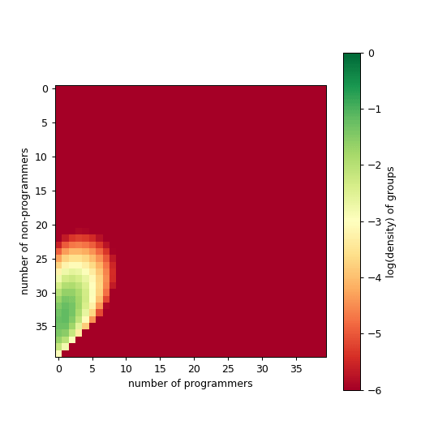
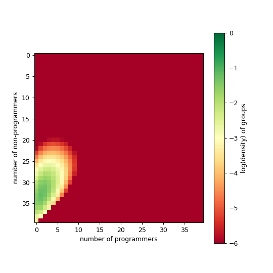

---
sql:
    data: tradeoff.parquet
---

# Modeling Comp Transition
## Introduction


We show some results that we have so far. Recall the procedure is as follows; 
- We start in the equilibrium state without programmers, then look at conditions under which we get to state with programmers. We want to get out of the first state, while accomplishing the following objectives:
    - Reduce number of sacrifice students in the transition
    - Do the transitions as quickly as possible
- We might expect the following **tradeoff**. Conceptually
    - On the one hand, if groups transition too fast, they would not leave the space for members to learn to code. More people will be left out in the transition, but since people keep flowing in, groups can still make the transition. Not nice for individuals. Hypothesis: _faster transition lead to more sacrificed people_.
    - Alternatively, groups could slow down the transitions, thereby leaving time for people to learn to code. In doing so, we might see smaller cumulative deaths for the same number of programmers, even it takes longer.  Hypothesis: _longer transition lead to fewer sacrificed people_.
    - Q: How can groups balance the objectives to both try to make transition as fast as possible while minimizing number of sacrificed people?
- We have the following key variables.
    - `cumulative death`: We keep track of how many people leave the system because as a result of a fail transition. 
    - `avgProgs`: We check the final fraction of programmers in the system.
    - `Time`: We now leave the system run for a given amount of time, then we look at different metrics

<div class="warning">All of the results have suffered the same Python filtering in the data loader to make it more lightweigth

```python
# To reduce memory usage
scale_factor = 1000  # Convert to a large integer scale
df['time_scaled'] = (df['time'] * scale_factor).astype(int)
df = df[df['time_scaled'] % int(1 * scale_factor) == 0]
       .drop(columns=['time_scaled']).reset_index(drop=True)

```
Also we use those default values
- μ=0.9
- νn=νp=0.2
- tau_rescaling=5.0

p.s. Some variable names might still be wrong, as we updated the code to the new model version.
</div>


<!-- <small>
    <details><summary>Procedure in excruciating details!</summary>
    </details>
</small> -->
 
Ok, lets look at some plots.

## Plot explainer

To find this tradeoff, we start by looking at `time` on the x-axis, with `cumulative deaths` and final `average programmers` on the y-axis.  We start by contrasting a small benefit (${tex`\chi=0.11`}) with a large one (${tex`\chi=0.33`}) of learning how to code to explain the plots. We focus on the effect of the cost function in the interpretation of this plot

```sql id=[...raw_data]
WITH unique_avgProgs AS (
    SELECT DISTINCT beta, avgProgs, k
    FROM data
)
SELECT d.beta::FLOAT as beta, d.time, d.avgProgs, d.costDeathsCum as cost, d.k::INT as k,
    (SELECT COUNT(*) 
     FROM unique_avgProgs u 
     WHERE u.k = d.k AND u.beta = d.beta AND u.avgProgs <= d.avgProgs
    )::FLOAT /
    (SELECT COUNT(*) 
     FROM unique_avgProgs u 
     WHERE u.k = d.k AND u.beta = d.beta
    ) AS avgProgs_percentile
FROM data d;
```

```js
let mydata = raw_data.filter(d => [15,25].includes(d.k) & [b1,b2].includes(+d.beta.toFixed(2)))
let mydata2 = raw_data.filter(d => [25].includes(d.k) & [0.06, 0.11, 0.14, 0.17, 0.20, 0.24].includes(+d.beta.toFixed(2)))
let mydata3 = raw_data.filter(d => [15,25].includes(d.k))
```


<div class="grid grid-cols-2">
    <div>
    ${simple1(mydata, {width: 600, facet: true})}
    ${simple2(mydata, {width: 600, facet: true})}
    </div>
    <div>
        <ul>
        <li>You can play with the helper functions here:</li>
        <div class="grid grid-cols-2">
        ${helpers1()}
        ${helpers2()}
        </div>
        <div class="grid grid-cols-2">
        ${helpers3()}
        ${helpers4()}
        </div>
        ${chiInput}
        ${kcInput}
        ${x0cInput}
        </ul>
    </div>
</div>

```js
const chiInput = Inputs.range([0.05, 0.5], {label:"χ", step:0.01, value: 0.05})
const chi = Generators.input(chiInput);

const kcInput = Inputs.range([1, 50], {label:"kc", step:1, value: 30})
const kc = Generators.input(kcInput);

const x0cInput = Inputs.range([0, 1], {label:"x0c", step:0.1, value: 0.4})
const x0c = Generators.input(x0cInput);
```

```js
function simple1(data, {width, facet} = {}) {
    return Plot.plot({
        height: 300,
        width,
        color: {legend: true, type: 'ordinal', label: "χ"},
        grid: true,
        nice:true,
        y: {type: do_log_simple ? 'log' : 'linear', label : 'cumulative deaths'}, 
        fx: {label: "ktau"},
        x: {label: null},
        marks: [
            Plot.frame(),
            Plot.line(data, {
                x: 'time',  y: 'cost',  stroke: facet ? "beta" : null, fx:  facet ? 'k' : null
            })
        ]
    })
}

function simple2(data, {width, facet} = {}) {
    return Plot.plot({
        height: 300,
        width,
        color: {type: 'linear'},
        grid: true,
        nice:true,
        y: {label : 'average Progs'}, 
        x: {label: 'time'},
        fx: {label: "ktau"},
        marks: [
            Plot.frame(),
            facet ? 
                null : 
                Plot.ruleX([0.23], {stroke:'red'}) ,
            Plot.line(data, {
                x: 'time',  y: 'avgProgs',  stroke:  facet ? "beta" : null, fx:  facet ? 'k' : null
            })
        ]
    })
}
```
You can play the same game with other χ. 

```js
let b1 = view(Inputs.range([0.06,0.30], {label: "Low χ", step:0.01, value:0.11}))
let b2 = view(Inputs.range([0.12,0.30], {label: "High χ", step:0.01, value:0.30}))
```
We find that ...

```sql
SELECT * FROM data WHERE beta = 0.11
```


## More χs


```js
let do_log_simple = view(Inputs.toggle({label: 'log yaxis'}))
```

<div class="grid grid-cols-2">
    <div>
    ${simple1(mydata2, {width: 600, facet: true})}
    ${simple2(mydata2, {width: 600, facet: true})}
    </div>
<div>
    <br><br>
    ${
    Plot.plot({
        height: 300,
        width: 600,
        x: {label: "χ"},
        y: {grid: true, type: "log"},
        marks: [
                Plot.dot(foo.filter(d => d.k==25), {x: 'beta', y: 'costDeathsCum', fill: "beta", tip: true }),
                Plot.dot(foo.filter(d => d.k==25), {x: 'beta', y: 'costDeathsCum', fill: "beta", fillOpacity: 0.3 }),
                Plot.ruleX([0.10, 0.15], {strokeDasharray: 3}),
                Plot.frame()
            ]
        })
    }
    ${
        Plot.plot({
        height: 300,
        width: 600,
        x: {label: "χ"},
        y: {grid: true},
        nice:true,
        caption: "tau_rescaling=5.0; ktau=25.0; kc=30",
        marks: [
            Plot.dot(foo.filter(d => d.k==25), {x: 'beta', y: 'avgProgs', fill: "beta", tip: true }),
            Plot.dot(foo.filter(d => d.k==25), {x: 'beta', y: 'avgProgs', fill: "beta", fillOpacity: 0.3 }),
            Plot.ruleX([0.10, 0.15], {strokeDasharray: 3}),
            Plot.frame()
            ]
        })
    }
    </div>
</div>


Okay, where is the tradeoff? 

Explain the tradeoff

<!-- ### GIFs

Below we show a couple of movie of what different time dynamics feel like for particular set of parameters. 

<div class="grid grid-cols-3">
    <div>
        
        <small><em>Large beta, moderate k, small x0</em></small><br>
        <small>μ   νn   νp   α    β   k   x0   K 10 11 12 TEMP LOG tmax</small><br>
        <small>100 10 10 10 60 3 0.05 40 40 40 4 1 0 1000</small>
    </div>
    <div>
        
        <small><em>Large beta, moderate k, small x0</em></small><br>
        <small>μ   νn νp  α  β   k   x0   K 10 11 12 TEMP LOG tmax</small><br>
        <small>100 10 10 10 39 3 0.05 40 40 40 4 1 0 1000</small>
    </div>
    <div>
        
        <small><em>Large beta, moderate k, small x0</em></small><br>
        <small>μ   νn νp  α  β   k   x0   K 10 11 12 TEMP LOG tmax</small><br>
        <small>100 10 10 10 46 3 0.05 40 40 40 4 1 0 1000</small>
    </div>
</div> -->


## State space(ish)

Ok, now we are doing something different. Lets try to put on the x-axis cumulative death and on the y-axis the average number of programmers. 


```sql id=[...foo]
SELECT 
    d.beta::FLOAT as beta, 
    d.k::INT as k, 
    d.avgprogs,
    d.time,
    d.costDeathsCum,
    d.costDeathsCum / NULLIF(d.time, 0) AS costDeathsCum_norm
FROM data d
WHERE d.time = (
    SELECT MAX(time) 
    FROM data d2 
    WHERE d2.beta = d.beta AND d2.k = d.k
) 
ORDER BY d.beta;
```


```js
let sel_beta = view(Inputs.range([0.11,0.33], {label: "Choose a", step: 0.01, value: 0.11}))
const do_norm = view(Inputs.toggle({label: "normalize by time"}))
const do_log = view(Inputs.toggle({label: "log"}))
```

<div class="grid grid-cols-2">
    <div>
    ${beta_plot(mydata3)}
    </div>
    <div>
    ${phase_space_plot(foo)}
    </div>
</div>

```js
const beta_plot = function(data) {
    const make_title = (d) => `time: ${d.time}\nbeta: ${d.beta}\nalpha: 10.0\nAvg #progs: ${d.avgProgs}\nPercentile: ${d.avgProgs_percentile.toFixed(3)}`

    return Plot.plot({
        grid: true,
        height: 400,
        width: 600,
        color: {legend:true, type: "ordinal", label: "ktau"},
        x: {type: "log", label: "cumulative death"},
        y: {label: "average # programmers"},
        caption: `The goal is somewhat to get as fast as possible up, without going too much on the right.`,
        marks: [
        [15,25].map(k=>
             Plot.line(data, { 
                filter: d => d.k == k & +d.beta.toFixed(2) == sel_beta,
                x: "cost", y: 'avgProgs', stroke: 'k'}
            )
        ),
        [15,25].map(k=>
            Plot.dot(data, {
                filter: (d,i) => d.k == k & +d.beta.toFixed(2) == sel_beta & i % 1 == 0 ? d : null, 
                x: "cost", y: 'avgProgs', 
                fill: "k",
                // tip: true,
                title: d => make_title(d)
            })
        )
        ]
})
    
    
    return 
    
    }
```

```js
function phase_space_plot(data) {
    return Plot.plot({
    grid: true,
    width: 600,
    height: 400,
    x: {
        type: do_log ? "log" : "linear", 
        label: do_norm ? "Last cumulative death rate" : "Last  cumulative death"
        },
    color: {legend:true, type: "ordinal"},
    marks: [
        Plot.dot(data, {
            x: do_norm ? "costDeathsCum_norm" : 'costDeathsCum', 
            y: 'avgProgs', 
            fill: "k", tip: true, title: d=>`β: ${d.beta}`
        }),
        Plot.line(data, {
            x: do_norm ? "costDeathsCum_norm" : 'costDeathsCum', 
            y: 'avgProgs', stroke: "k"
        }),
        Plot.dot(data, {
            filter: d=>+d.beta.toFixed(2) == sel_beta,
            x: do_norm ? "costDeathsCum_norm" : 'costDeathsCum', 
            y: 'avgProgs', 
            r: 6,
            fill: "yellow", stroke: "black",
            symbol: 'star'
        }),
    ]
    }
)
}
```

Explain takeaways fro the plots.

The plot on the RHS is a kind of a map to know where we are. Instead of looking at time evolution, we plot total deaths and average number of programmers at equilibrium. 


## Beyond simplicity: the hydra plot

TBD if this is a good plot. It is pretty wild. As before, as you go farther right, more people left the system (depending on how we define equilibrium state). As you go up, you have more programmers. 

```js
let all = view(Inputs.toggle({label: 'show all betas'}))
```

<div class="grid grid-cols-2">
    <div>
    ${tradeoff_plot(all ? mydata3 : mydata2.filter(d=>[15,25].includes(d.k)))}
    </div>
    <div>
    <em>notes:</em>
    <ul>
    <li>The black squares represent timestep 0.03, 1.5, and 15 (pretty random). By looking at cumulative death, we introduce a distortion. If we think back at our previous plots, we saw that large beta means that early stopping, with many programmers. </li>
    </ul>
    </div>
</div>

```js
const tradeoff_plot = function(data) {

    const make_title = (d) => `time: ${d.time}\nbeta: ${d.beta}\nalpha: 10.0\nAvg #progs: ${d.avgProgs}\nPercentile: ${d.avgProgs_percentile.toFixed(3)}`

    return Plot.plot({
        grid: true,
        color: {
            legend:true, 
            type: "linear"
            },
        x: {type: "log", label: "cumutative death"},
        y: {label: "average # programmers"},
        height: 400,
        width: 600,
        nice:true,
        marks: [
            Plot.frame(),
            Plot.line(data, {
                x: 'cost', y: 'avgProgs', stroke: 'beta', fy: 'k',  strokeWidth: 5,
            }),
            // Plot.dot(data, {
            //     x: 'cost', y: 'avgProgs', 
            //     fillOpacity: 0.8,
            //     fy: 'k',
            //     // tip: true,
            //     title: d => make_title(d)
            // }),
            // Plot.dot(data, {
            //     filter: d => [0.03, 1.5, 5, 15, 25].includes(d.time),
            //     x: 'cost', y: 'avgProgs', 
            //     fill: "black", r: 2.5, 
            //     symbol: "square",
            //     tip: true,
            //     fy: 'k',
            //     title: d => make_title(d)
            // })
            ]
    })
    
    }
```

We call this the hydra plot. [Explain the plot] 


## More ideas

- For us, one idea would be that the landscape (institutions) are broadly constant, while one population (of programmers) could end up either displacing the other or could live in a bistable regime. This is another occasion to model timescale separation!


<!-- APPENDIX -->

```js

function helpers1() {
    let a = 1/chi;
    let ktau = 25;

    return Plot.plot({
    nice: true,
    grid: true,
    width: 300, 
    height: 200,
    color: {domain: ["B","C","Π"], range: ["blue","green", "red"], legend:true},
    x: {label:"#progs/# non-progs"},
    y: {label:"f(x)"},
    marks: [
        Plot.frame(),
        Plot.line(
            d3.range(0, 1, 0.01),
            { x: x => x, y: x => B(x, a), stroke: "blue", strokeWidth: 3 }
        ),
        Plot.line(
            d3.range(0, 1, 0.01),
            { x: x => x, y: x => C(x, kc, x0c), stroke: "green" }
        ),
        Plot.line(
            d3.range(0, 1, 0.01),
            { x: x => x, y: x => PI(x, a), stroke: "red", strokeDasharray: 10, strokeWidth: 3}
        )
    ]
})
}

function helpers2() {
    let a = 1/chi;
    let ktau = 25; 

    return Plot.plot({
    nice: true,
    grid: true,
    width: 300, 
    height: 200,
    color: {domain: ["B-C","B-C+Π"], range: ["blue","orange"], legend:true},
    x: {label:"#progs/# non-progs"},
    y: {label:"f(x)"},
    marks: [
        Plot.frame(),
        Plot.line(
            d3.range(0, 1, 0.01),
            { x: x => x, y: x => B(x, a) - C(x, kc, x0c), stroke: "orange" }
        ),
        Plot.line(
            d3.range(0, 1, 0.01),
            { x: x => x, y: x => B(x, a) - C(x, kc, x0c) + PI(x, ktau, a, kc, x0c), stroke: "green" }
        )
    ]
})
}

function helpers3() {
    let a = 1/chi;
    let ktau = 25; 

    return Plot.plot({
    nice: true,
    grid: true,
    width: 300, 
    height: 200,
    color: {domain: ["tau(x)"], range: ["grey"], legend:true},
    x: {label:"#progs/# non-progs"},
    y: {label:"f(x)"},
    marks: [
        Plot.frame(),
        Plot.line(
            d3.range(0, 1, 0.01),
            { x: x => x, y: x => tau(x, ktau, a, kc, x0c), stroke: "grey" }
        ),
    ]
})
}

function helpers4() {
    let a = 1/chi;
    let ktau = 25; 

    return Plot.plot({
    nice: true,
    grid: true,
    width: 300, 
    height: 200,
    color: {domain: ["tau*(1-C)"], range: ["black"], legend:true},
    x: {label:"#progs/# non-progs"},
    y: {label:"f(x)"},
    marks: [
        Plot.frame(),
        Plot.line(
            d3.range(0, 1, 0.01),
            { x: x => x, y: x => tau(x, ktau, a, kc, x0c)*(1-C(x, kc, x0c) )}
        ),
    ]
})
}

function B(x, a) {
    return (1 - 5*0.1)*Math.exp(-a*x) + 0.1
}

function PI(x, a) {
    return (1 - 5*0.1)*Math.exp(-a*x) + 0.1
}

function C(x, kc, x0c) {
    return (1 - (5*0.1))*(1. / (1. + Math.exp(kc * (x - x0c)))) + 0.1
} 

function tau(x, ktau, a, kc, x0c) {
    return 5*(1. / (1. + Math.exp(-ktau * (B(x, a) - C(x, kc, x0c) + PI(x, a)))) )
} 
```

<style>

    .img-margin-right {
        float: right;
        margin-left: 20px; /* Adjust the left margin to space it from surrounding content */
        margin-bottom: 20px;
        max-width: 100%;
        height: auto;
    }


</style>