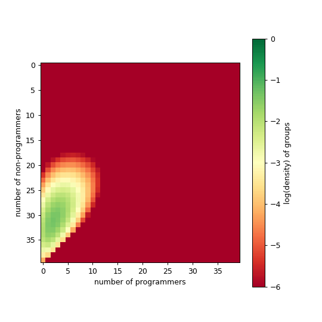

---
sql:
    data: tradeoff.parquet
---

# Modeling Comp Transition

We show some results that we have so far. Recall the procedure is as follows; we start in the equilibrium state without much programming, then look at conditions under which we get to state with programmers. 
- `cumulative death`: We keep track of how many people leave the system because as a result of a fail transition. 
- `avgProgs`: We also keep track how long does it take to transition to the equilibrium state with programmers. Once they get there, we check the average number of programmers in the system. 
- We want to demonstrate the potential following **tradeoff**:
    - On the one hand, what if transitioning too fast lead to more or less people in the system. Groups might want to transition fast because it increases their benefits. But if they transition too fast, they do not leave the space for members to learn to code. More people will be left out in the transition, but since people keep flowing in groups might be willing to adopt that strategy. 
    - Alternatively, groups could slow down the transitions, thereby leaving time for people to learn to code. In doing so, we might see smaller cumulative deaths for the same number of programmers. 


<small>
    <details><summary>Procedure in excruciating details!</summary>
    <br>
    <h4>The model and initial conditions</h4>
    <ul>
        <li>Learning to code entails an individual cost. When it is too costly, people try and fail (and leave the system). The cost function is dependent on the number of programmers groups. The form to be a sigmoid where we play with _k_ (the steepneess of the slope) and _x0_ (its midpoint).</li>
        <li>We also show how those values change with <em>k</em>, the slope of the cost function:</li>
            ${cost_function_plot()}
            ${x0Input}
        <li>We always start with large research groups at equilibrium with 35 non-progs and 0 programmer. We are interested into transient dynamics towards an alternative stable state with programmers.</li>
    </ul>
    <h4>What counts as 'finishing' the transition?</h4>
    <ul>
        <li>The transition is complete when the system reaches the final fraction of programmers. That is, after simulating for a long enough time (we use tmax=100, which is enough given big enough recruitment rate (=100) and graduate rate (=10), we grab the last value for which the difference in average programmers stops changing within a specified accuracy (eps_abs = 1e-6; eps_rel = 1e-8).</li>
        <li>Under some conditions, it takes a long time before reaching that final state. To facilitate the comparison, we might be interested in stopping early when we get 'close enough' to the final fraction of programmers. In this case, we calculate the percentile of completeness for each value of the fraction, then probive the option to filter out values lower than a given percentile.</li>
    </ul>
    ${Inputs.table(mydata.filter(d=>d.beta==30), {width: 650})}
    </details>
</small>
 

To find this tradeoff, we start by looking at `time to finish transition` on the x-axis, with `cumulative deaths` and final `average programmers` on the y-axis.  We start with a small (=30) and large (=53) beta to explain the plots:

```sql id=[...raw_data]
WITH unique_avgProgs AS (
    SELECT DISTINCT beta, avgProgs, k
    FROM data
)
SELECT d.beta::INT as beta, d.time, d.avgProgs, d.costDeathsCum as cost, d.k::INT as k,
    (SELECT COUNT(*) 
     FROM unique_avgProgs u 
     WHERE u.k = d.k AND u.beta = d.beta AND u.avgProgs <= d.avgProgs
    )::FLOAT /
    (SELECT COUNT(*) 
     FROM unique_avgProgs u 
     WHERE u.k = d.k AND u.beta = d.beta
    ) AS avgProgs_percentile
FROM data d;
```

```js
let mydata = raw_data.filter(d => [3,6].includes(d.k) & [30,53].includes(d.beta))
let mydata2 = raw_data.filter(d => [1,3,6,15].includes(d.k) & [30,40,42,44,46, 53].includes(d.beta))
let mydata3 = raw_data.filter(d => [1,3,6,15].includes(d.k))
```

```js
let thresh = view(Inputs.range([0.8,1], {
    value: 1.0, step:0.01, label: "precentile removed (this will impact both plots below)"
}))
```
<div class="grid grid-cols-2">
    <div>
    ${simple1(mydata, {width: 600})}
    ${simple2(mydata, {width: 600})}
    </div>
    <div>
        <ul>
        <small>
            <li>Color is the coding benefit. Larger means it is more beneficial. Alpha, non-programmers benefits, is fixed at 10</li>
            <li>In this case, a gentler slope (<em>k=3</em>) seems favorable, as we end up with as many programmers, but much fewer deaths.  </li>
        </small>
        </ul>
    </div>
</div>

```js
const x0Input = Inputs.range([0.05, 0.5], {label:"x0", step:0.01, value: 0.05})
const x0 = Generators.input(x0Input);
```
We provide the option to play with the finishing procedure (see details for explanation). For instance, what if we consider the transition finished when we reach 95% of the final fraction of programmers? In this case, we can see that the cumulative deaths for low beta (=30) is now lower than that of high beta (=53

## More Betas


```js
let do_log_simple = view(Inputs.toggle({label: 'log yaxis'}))
```

```js
simple1(mydata2, {width: 1200})
```

```js
simple2(mydata2, {width: 1200})
```

## State space(ish)

Ok, now we are doing something different. Lets try to put on the x-axis cumulative death and on the y-axis the average number of programmers. I find it requires a bit more love to like it. But the idea is that because we are looking at cumulative deaths, we are looking at time but the ticks show how many people have left the system. If you try beta=55, you'll see, as before, that the system transitionned fast into state with many programmers as it goes straight up and it doesn't get far on the right.

We also introduce a second plot (right), where we only look at the equilibrium state (think about it as a roadmap for the plot on the left). In this plot, we can see how moderate value of beta lead to most people leaving the system; programming is valuable enough that people try it, but not enough that the cost is minimized (is that right? Im asking to myself). If we look back to the previous plot, we can see that the early stopping of the k=3.

```sql id=[...foo]
SELECT 
    d.beta::INT as beta, 
    d.k::INT as k, 
    d.*, 
    d.costDeathsCum / NULLIF(d.time, 0) AS costDeathsCum_norm
FROM data d
WHERE d.time = (
    SELECT MAX(time) 
    FROM data d2 
    WHERE d2.beta = d.beta AND d2.k = d.k
) AND d.beta > 10
ORDER BY d.beta;
```

```js
let sel_beta = view(Inputs.range([10,60], {label: "Choose beta", step: 1, value: 45}))
const do_norm = view(Inputs.toggle({label: "normalize by time"}))
const do_log = view(Inputs.toggle({label: "log"}))
```

<div class="grid grid-cols-2">
    <div>
    ${beta_plot(mydata3)}
    </div>
    <div>
    ${phase_space_plot()}
    </div>
</div>

```js
const beta_plot = function(data) {
    const make_title = (d) => `time: ${d.time}\nbeta: ${d.beta}\nalpha: 10.0\nAvg #progs: ${d.avgProgs}\nPercentile: ${d.avgProgs_percentile.toFixed(3)}`

    return Plot.plot({
        grid: true,
        height: 400,
        width: 600,
        color: {legend:true, type: "ordinal"},
        x: {type: "log", label: "cumulative death"},
        y: {label: "average # programmers"},
        caption: `The goal is somewhat to get as fast as possible up, without going too much on the right.`,
        marks: [
        [1,3,6,15].map(k=>
             Plot.line(data, { 
                filter: d => d.k == k & d.beta == sel_beta,
                x: "cost", y: 'avgProgs', stroke: 'k'}
            )
        ),
        [1,3,6,15].map(k=>
            Plot.dot(data, {
                filter: (d,i) => d.k == k & d.beta == sel_beta & i % 1 == 0 ? d : null, 
                x: "cost", y: 'avgProgs', 
                fill: "k",
                fillOpacity: d => d.avgProgs_percentile <= thresh ? 1.0 : 0.,
                // tip: true,
                title: d => make_title(d)
            })
        )
        ]
})
    
    
    return 
    
    }
```

```js
function phase_space_plot() {
    return Plot.plot({
    grid: true,
    width: 600,
    height: 400,
    x: {
        type: do_log ? "log" : "linear", 
        label: do_norm ? "Last cumulative death rate" : "Last  cumulative death"
        },
    color: {legend:true, type: "ordinal"},
    marks: [
        Plot.dot(foo, {
            x: do_norm ? "costDeathsCum_norm" : 'costDeathsCum', 
            y: 'avgProgs', 
            fill: "k", tip: true, title: d=>`β: ${d.beta}`
        }),
        Plot.line(foo, {
            x: do_norm ? "costDeathsCum_norm" : 'costDeathsCum', 
            y: 'avgProgs', stroke: "k"
        }),
        Plot.dot(foo, {
            filter: d=>d.beta == sel_beta,
            x: do_norm ? "costDeathsCum_norm" : 'costDeathsCum', 
            y: 'avgProgs', 
            r: 6,
            fill: "yellow", stroke: "black",
            symbol: 'star'
        }),
    ]
    }
)
}
```

When the plot on the RHS is normalized by time, we actually something interesting; the rate at which people leave the system. For instance, if unnormalized, we see a large difference in cumulative death of _k=3_ and _k=6_, with smaller _k_ having much fewer deaths. But once we normalize, we see that, for moderate values of betas, they are aligned; that is, even though the transition for _k=3_ is faster, there not fewer death as a results.  

## Beyond simplicity: the hydra plot

TBD if this is a good plot. It is pretty wild. As before, as you go farther right, more people left the system (depending on how we define equilibrium state). As you go up, you have more programmers. 

```js
let all = view(Inputs.toggle({label: 'show all betas'}))
```

<div class="grid grid-cols-2">
    <div>
    ${tradeoff_plot(all ? mydata3 : mydata2.filter(d=>[3,6].includes(d.k)))}
    </div>
    <div>
    <em>notes:</em>
    <ul>
    <li>The black squares represent timestep 0.03, 1.5, and 15 (pretty random). By looking at cumulative death, we introduce a distortion. If we think back at our previous plots, we saw that large beta means that early stopping, with many programmers. </li>
    </ul>
    </div>
</div>

```js
const tradeoff_plot = function(data) {

    const make_title = (d) => `time: ${d.time}\nbeta: ${d.beta}\nalpha: 10.0\nAvg #progs: ${d.avgProgs}\nPercentile: ${d.avgProgs_percentile.toFixed(3)}`

    return Plot.plot({
        grid: true,
        color: {
            legend:true, 
            type: "linear"
            },
        x: {type: "log", label: "cumutative death"},
        y: {label: "average # programmers"},
        height: 600,
        width: 600,
        marks: [
            Plot.line(data, {
                x: 'cost', y: 'avgProgs', stroke: 'beta', strokeOpacity: 0.3, fy: 'k'
            }),
            Plot.dot(data, {
                x: 'cost', y: 'avgProgs', 
                fill: d => d.avgProgs_percentile <= thresh ? d.beta : null,
                fillOpacity: 0.8,
                fy: 'k',
                // tip: true,
                title: d => make_title(d)
            }),
            Plot.dot(data, {
                filter: d => [0.03, 1.5, 5, 15, 25].includes(d.time),
                x: 'cost', y: 'avgProgs', 
                fill: "black", r: 2.5, 
                symbol: "square",
                tip: true,
                fy: 'k',
                title: d => make_title(d)
            })
            ]
    })
    
    }
```

We call this the hydra plot. The heads are given by varying beta, while the tongues are what is left when we cutoff the dynamics based on some percentage of the final state (here defined as ${thresh*100}% of the average number of programmers at equilibrium). For instance, we smaller _k_ (less steep cost function) entails a larger cutoff effect. It make sense, as steep cost function entails a all or nothing situation, so the transition is happening faster. In the next plot, we offer a more focused version of the first plot, where we zoom in on a specific values of beta for different _k_ on the transition. We can see, for instance, that _k=1_ ends up being 

The plot on the RHS is a kind of a map to know where we are. Instead of looking at time evolution, we plot total deaths and average number of programmers at equilibrium. 


### GIFs

Below we show a couple of movie of what different time dynamics feel like for particular set of parameters. 

<div class="grid grid-cols-3">
    <div>
    
    <small><em>Large beta, moderate k, small x0</em></small><br>
    <small>μ   νn   νp   α    β   k   x0   K 10 11 12 TEMP LOG tmax</small><br>
    <small>100 10 10 10 60 3 0.05 40 40 40 4 1 0 100</small>
    </div>
    <div>
    </div>
    <div>
    </div>
</div>


## More ideas

- For us, one idea would be that the landscape (institutions) are broadly constant, while one population (of programmers) could end up either displacing the other or could live in a bistable regime. This is another occasion to model timescale separation!


<!-- APPENDIX -->

```js
function simple1(data, {width} = {}) {
    return Plot.plot({
        height: 300,
        width,
        color: {legend: true, type: 'linear'},
        grid: true,
        y: {type: do_log_simple ? 'log' : 'linear', label : 'cumulative deaths'}, 
        x: {label: null},
        marks: [
            Plot.frame(),
            Plot.line(data, {
                x: 'time',  y: 'cost',  stroke: "beta", strokeOpacity: 0.3, fx: 'k', tip:true
            }),
            Plot.dot(data, {
                x: 'time', y: 'cost', 
                fill: d => d.avgProgs_percentile <= thresh ? d.beta : null, r: 2, fx: 'k'
            }
            )
        ]
    })
}

function simple2(data, {width} = {}) {
    return Plot.plot({
        height: 300,
        width,
        color: {type: 'linear'},
        grid: true,
        y: {label : 'average Progs'}, 
        x: {label: 'time to finish transition'},
        marks: [
            Plot.frame(),
            Plot.line(data, {
                x: 'time',  y: 'avgProgs',  stroke: "beta", strokeOpacity: 0.3, fx: 'k'
            }),
            Plot.dot(data, {
                x: 'time', y: 'avgProgs', 
                fill: d => d.avgProgs_percentile <= thresh ? d.beta : null, r: 2, fx: 'k'
                }
            )
        ]
    })
}

function cost_function_plot() {
    return Plot.plot({
    nice: true,
    grid: true,
    width: 300, 
    height: 200,
    color: {domain: ["k=1","k=3","k=6","k=15"], range: ["blue","green", "red", "orange"], legend:true},
    x: {label:"#progs/# non-progs"},
    y: {label:"Cost learning to code", domain: [0,1]},
    marks: [
        Plot.frame(),
        Plot.line(
            d3.range(0, 1, 0.01),
            { x: x => x, y: x => c(x, 15, x0), stroke: "orange" }
        ),
        Plot.line(
            d3.range(0, 1, 0.01),
            { x: x => x, y: x => c(x, 6, x0), stroke: "red" }
        ),
        Plot.line(
            d3.range(0, 1, 0.01),
            { x: x => x, y: x => c(x, 3, x0), stroke: "green" }
        ),
        Plot.line(
            d3.range(0, 1, 0.01),
            { x: x => x, y: x => c(x, 1, x0), stroke: "blue" }
        )
    ]
})
}

function c(x,k,x0) {
    return 1 / (1 + Math.exp(k*( x - x0)))
}

function tau(a,b,x,k,x0) {
    return 1 / (1 + Math.exp(k*( x - x0)))
}
```


<style>

    .img-margin-right {
        float: right;
        margin-left: 20px; /* Adjust the left margin to space it from surrounding content */
        margin-bottom: 20px;
        max-width: 100%;
        height: auto;
    }


</style>