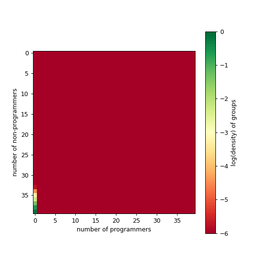
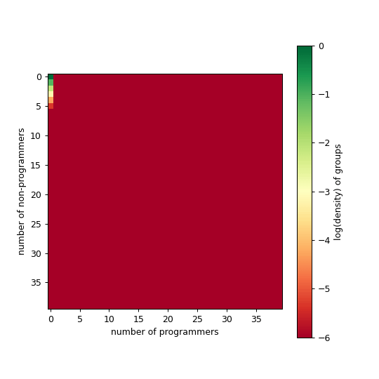
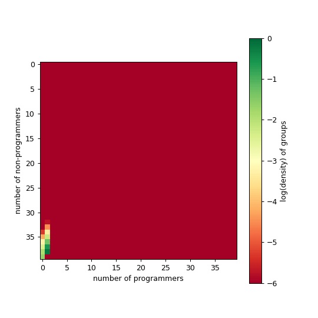

---
sql:
    data: tradeoff.parquet
---

# Modeling Comp Transition

We show some results that we have so far. Recall the procedure is as follows: 

- We start with large research groups at equilibrium with 35 non-progs and 0 programmer. We are interested into transient dynamics towards an alternative stable state with programmers.  
- Learning to code entails an individual cost. When it is too costly, people try and fail (and leave the system). The cost function is dependent on the number of programmers groups. We the form to be a sigmoid where we play with _k_ (the steepneess of the slope) and _x0_ (its midpoint). See lab notes below.
- `cumulative death`: We keep track of how many people leave the system because as a result of a fail transition. 
- `avgProgs`: We also keep track how long does it take to transition to the equilibrium state with programmers. Once they get there, we check the average number of programmers in the system. 
- We want to demonstrate the potential following **tradeoff**:
    - On the one hand, what if transitioning too fast lead to more or less people in the system. Groups might want to transition fast because it increases their benefits. But if they transition too fast, they do not leave the space for members to learn to code. More people will be left out in the transition, but since people keep flowing in groups might be willing to adopt that strategy. 
    - Alternatively, groups could slow down the transitions, thereby leaving time for people to learn to code. In doing so, we might see smaller cumulative deaths for the same number of programmers.  

To find this tradeoff, we start by lookging at `time to finish transition` on the xaxis, with `cumulative deaths` and final `average programmers` on the yaxis. We start with a small (=30) and large (=53) beta to explain the plots:

```sql id=[...raw_data]
WITH unique_avgProgs AS (
    SELECT DISTINCT beta, avgProgs, k
    FROM data
)
SELECT d.beta::INT as beta, d.time, d.avgProgs, d.costDeathsCum as cost, d.k::INT as k,
    (SELECT COUNT(*) 
     FROM unique_avgProgs u 
     WHERE u.k = d.k AND u.beta = d.beta AND u.avgProgs <= d.avgProgs
    )::FLOAT /
    (SELECT COUNT(*) 
     FROM unique_avgProgs u 
     WHERE u.k = d.k AND u.beta = d.beta
    ) AS avgProgs_percentile
FROM data d;
```

```js
let mydata = raw_data.filter(d => [3,6].includes(d.k) & [30,53].includes(d.beta))
let mydata2 = raw_data.filter(d => [1,3,6,15].includes(d.k) & [30,40,42,44,46, 53].includes(d.beta))
let mydata3 = raw_data.filter(d => [1,3,6,15].includes(d.k))
```

```js
let thresh = view(Inputs.range([0.8,1], {
    value: 1.0, step:0.01, label: "precentile removed (this will impact both plots below)"
}))
```
<div class="grid grid-cols-2">
    <div>
    ${simple1(mydata, {width: 600})}
    ${simple2(mydata, {width: 600})}
    </div>
    <div>
        <ul>
        <small>
            <li>Color is the coding benefit. Larger means it is more beneficial. Alpha, non-programmers benefits, is fixed at 10</li>
            <li>We also show how those values change with <em>k</em>, the slope of the cost function:</li>
            ${cost_function_plot()}
            ${x0Input}
            <li>In this case, a gentler slope (<em>k=3</em>) seems favorable, as we end up with as many programmers, but much fewer deaths.  </li>
            <li>What counts as 'finishing' the transition? The transition is complete when the system reaches the final fraction of programmers. That is, after simulating for a long enough time (tmax=100 is enough, given big enough recruitment rate (=100) and graduate rate (=10), we grab the last value for which the difference in average programmers stops changing within a specified accuracy (eps_abs = 1e-6; eps_rel = 1e-8).
            <li>We provide the option to play with that. For instance, what if we consider the transition finished when we reach 95% of the final fraction of programmers? In this case, we can see that the cumulative deaths for low beta (=30) is now lower than that of high beta (=53)</li> 
        </small>
        </ul>
    </div>
</div>

```js
const x0Input = Inputs.range([0.05, 0.5], {label:"x0", step:0.01, value: 0.05})
const x0 = Generators.input(x0Input);
```


## More Betas


```js
let do_log_simple = view(Inputs.toggle({label: 'log yaxis'}))
```

```js
simple1(mydata2, {width: 1200})
```

```js
simple2(mydata2, {width: 1200})
```

## State space(ish)

Ok, now we are doing something different. Lets try to put on the x-axis cumulative death and on the y-axis the average number of programmers. I find it requires a bit more love to like it. But the idea is that because we are looking at cumulative deaths, we are looking at time but the ticks show how many people have left the system. If you try beta=55, you'll see, as before, that the system transitionned fast into state with many programmers as it goes straight up and it doesn't get far on the right.

We also introduce a second plot (right), where we only look at the equilibrium state (think about it as a roadmap for the plot on the left). In this plot, we can see how moderate value of beta lead to most people leaving the system; programming is valuable enough that people try it, but not enough that the cost is minimized (is that right? Im asking to myself). If we look back to the previous plot, we can see that the early stopping of the k=3.

```sql id=[...foo]
SELECT 
    d.beta::INT as beta, 
    d.k::INT as k, 
    d.*, 
    d.costDeathsCum / NULLIF(d.time, 0) AS costDeathsCum_norm
FROM data d
WHERE d.time = (
    SELECT MAX(time) 
    FROM data d2 
    WHERE d2.beta = d.beta AND d2.k = d.k
) AND d.beta > 10
ORDER BY d.beta;
```

```js
let sel_beta = view(Inputs.range([10,60], {label: "Choose beta", step: 1, value: 45}))
const do_norm = view(Inputs.toggle({label: "normalize by time"}))
const do_log = view(Inputs.toggle({label: "log"}))
```

<div class="grid grid-cols-2">
    <div>
    ${beta_plot(mydata3)}
    </div>
    <div>
    ${phase_space_plot()}
    </div>
</div>

```js
const beta_plot = function(data) {
    const make_title = (d) => `time: ${d.time}\nbeta: ${d.beta}\nalpha: 10.0\nAvg #progs: ${d.avgProgs}\nPercentile: ${d.avgProgs_percentile.toFixed(3)}`

    return Plot.plot({
        grid: true,
        height: 400,
        width: 600,
        color: {legend:true, type: "ordinal"},
        x: {type: "log", label: "cumulative death"},
        y: {label: "average # programmers"},
        caption: `The goal is somewhat to get as fast as possible up, without going too much on the right.`,
        marks: [
        [1,3,6,15].map(k=>
             Plot.line(data, { 
                filter: d => d.k == k & d.beta == sel_beta,
                x: "cost", y: 'avgProgs', stroke: 'k'}
            )
        ),
        [1,3,6,15].map(k=>
            Plot.dot(data, {
                filter: (d,i) => d.k == k & d.beta == sel_beta & i % 1 == 0 ? d : null, 
                x: "cost", y: 'avgProgs', 
                fill: "k",
                fillOpacity: d => d.avgProgs_percentile <= thresh ? 1.0 : 0.,
                // tip: true,
                title: d => make_title(d)
            })
        )
        ]
})
    
    
    return 
    
    }
```

```js
function phase_space_plot() {
    return Plot.plot({
    grid: true,
    width: 600,
    height: 400,
    x: {
        type: do_log ? "log" : "linear", 
        label: do_norm ? "Last cumulative death rate" : "Last  cumulative death"
        },
    color: {legend:true, type: "ordinal"},
    marks: [
        Plot.dot(foo, {
            x: do_norm ? "costDeathsCum_norm" : 'costDeathsCum', 
            y: 'avgProgs', 
            fill: "k", tip: true, title: d=>`β: ${d.beta}`
        }),
        Plot.line(foo, {
            x: do_norm ? "costDeathsCum_norm" : 'costDeathsCum', 
            y: 'avgProgs', stroke: "k"
        }),
        Plot.dot(foo, {
            filter: d=>d.beta == sel_beta,
            x: do_norm ? "costDeathsCum_norm" : 'costDeathsCum', 
            y: 'avgProgs', 
            r: 6,
            fill: "yellow", stroke: "black",
            symbol: 'star'
        }),
    ]
    }
)
}
```

## Beyond simplicity: the hydra plot

TBD if this is a good plot. It is pretty wild. As before, as you go farther right, more people left the system (depending on how we define equilibrium state). As you go up, you have more programmers. 

```js
let all = view(Inputs.toggle({label: 'show all betas'}))
```

<div class="grid grid-cols-2">
    <div>
    ${tradeoff_plot(all ? mydata3 : mydata2.filter(d=>[3,6].includes(d.k)))}
    </div>
    <div>
    <em>notes:</em>
    <ul>
    <li>The black squares represent timestep 0.03, 1.5, and 15 (pretty random). By looking at cumulative death, we introduce a distortion. If we think back at our previous plots, we saw that large beta means that early stopping, with many programmers. </li>
    </ul>
    </div>
</div>

```js
const tradeoff_plot = function(data) {

    const make_title = (d) => `time: ${d.time}\nbeta: ${d.beta}\nalpha: 10.0\nAvg #progs: ${d.avgProgs}\nPercentile: ${d.avgProgs_percentile.toFixed(3)}`

    return Plot.plot({
        grid: true,
        color: {
            legend:true, 
            type: "linear"
            },
        x: {type: "log", label: "cumutative death"},
        y: {label: "average # programmers"},
        height: 600,
        width: 600,
        marks: [
            Plot.line(data, {
                x: 'cost', y: 'avgProgs', stroke: 'beta', strokeOpacity: 0.3, fy: 'k'
            }),
            Plot.dot(data, {
                x: 'cost', y: 'avgProgs', 
                fill: d => d.avgProgs_percentile <= thresh ? d.beta : null,
                fillOpacity: 0.8,
                fy: 'k',
                // tip: true,
                title: d => make_title(d)
            }),
            Plot.dot(data, {
                filter: d => [0.03, 1.5, 5, 15, 25].includes(d.time),
                x: 'cost', y: 'avgProgs', 
                fill: "black", r: 2.5, 
                symbol: "square",
                tip: true,
                fy: 'k',
                title: d => make_title(d)
            })
            ]
    })
    
    }
```

We call this the hydra plot. The heads are given by varying beta, while the tongues are what is left when we cutoff the dynamics based on some percentage of the final state (here defined as ${thresh*100}% of the average number of programmers at equilibrium). For instance, we smaller _k_ (less steep cost function) entails a larger cutoff effect. It make sense, as steep cost function entails a all or nothing situation, so the transition is happening faster. In the next plot, we offer a more focused version of the first plot, where we zoom in on a specific values of beta for different _k_ on the transition. We can see, for instance, that _k=1_ ends up being 

The plot on the RHS is a kind of a map to know where we are. Instead of looking at time evolution, we plot total deaths and average number of programmers at equilibrium. 


### GIFs

Below we show a couple of movie of what different time dynamics feel like for particular set of parameters. 

<div class="grid grid-cols-3">
    <div>
    
    <small><em>Large beta, moderate k, small x0</em></small><br>
    <small>μ   νn   νp   α    β   k   x0   K 10 11 12 TEMP LOG tmax</small><br>
    <small>100 10 10 10 60 3 0.05 40 40 40 4 1 0 100</small>
    </div>
    <div>
    </div>
    <div>
    </div>
</div>

---


## Hysteresis in the emergence of new skills

Intuitively (or naively), our small perturbations here would be that we increase the benefits to code which cannot be undone easily. Assume that the context is that humanities start valuing way too much 'computational approach' at the expense of domain expertise. Say that in philosophy, a hiring committee could  favor of someone who know a fair bit of programming over someone who has deep knowledge of Plato, but know nothing of programming. In this story, _X_ is number of programmers in the system, while _b_ is the parameter condition (like benefits to learn coding). As you add more benefits, nothing might happen for a while to the state of the system. But as you hit a critical threshold, you bifurcate to a new fixed point of programmers that is much higher than the previous one ('catastrophe' event). Unfortunately, as the story goes, to get get back to your favored equilibrium you need to 'remove' much more benefit (say by increasing the benefit of non-programmers) from the system than what has been allowed before.

## GMEs hysteresis: base model


We are interested in modeling the varying cost-benefit ratio of having programmers in research groups. Let ${tex`G_{n,p}`} be the fraction of groups with _n_ non-programmers and _p_ programmers. The idea is that we want to know under which conditions we can have bistable regime of groups with majority of programmers and non-programmers, in an shift environement (say, the humanities becoming more computational). We have the following model:

```tex
\begin{align*}
	\frac{d}{dt}G_{n,p} &= \textcolor{red}{\mu G_{n-1,p} \cdot (n+p)(1-\frac{n+p}{k})}  \\
                        &- \textcolor{blue}{\mu G_{n,p} \cdot (n+p+1)(1-\frac{n+p+1}{k})} \\
                        &+ \textcolor{red}{\nu_n(n+1)G_{n+1,p}} \\
                        &- \textcolor{blue}{n\nu_n G_{n,p}} \\
                        &+ \textcolor{red}{\nu_p(p+1)G_{n,p+1}} \\
                        &- \textcolor{blue}{p\nu_p G_{n,p}} \\
						&+ \textcolor{red}{\tau(\alpha, \beta, n+1, p-1)(n+1)(1 - c(n+1,p-1))*G_{n+1,p-1}} \\
                        &- \textcolor{blue}{\tau(\alpha, \beta, n, p)\cdot n\cdot (1-c(n,p))G_{n,p}} \\
                        &+ \textcolor{red}{\tau(\alpha, \beta, n+1, p) (n+1) c(n+1,p)G_{n+1,p}} \\
						&- \textcolor{blue}{\tau(\alpha, \beta, n, p)\cdot n\cdot c(n,p)G_{n,p} }
\end{align*}
```

The color coding maps to the picture on the right. The output flow (probability of leaving a state) is in ${tex`\textcolor{blue}{blue}`}, while the input flow is in ${tex`\textcolor{red}{red}`}.  We highlight a state (${tex`G_{2,2}`}, or 2 non-programmers and 2 programmers) to facilitate the interpretation. The params are

| params | description | 
| ----   | -----      |
| ${tex`n\nu_n`} | graduation non-programmers | 
| ${tex`p\nu_p`} | graduation programmers | 
| ${tex`\mu`} | inflow non-programmers | 
| ${tex`K`} | group carrying capacity | 
| ${tex`\alpha`} | benefit non-programmers | 
| ${tex`\beta`} | benefit programmers | 

| function | form | description |
| ----   | -----      |        ----         |
| ${tex`\tau_g(n,p)`} | ${tex`-\alpha + \beta(1-c(n,p))`} |            |
| ${tex`c(n,p)`} | TBD |                    |

We explore our different functions in the following subsections

#### Group benefits of coding

Learning to code confers a collective benefits on individuals ${tex`\tau(n,p) \propto \bar{Z}_{n,p}Z_{n,p}^{-1}`}. We define the current benefit to be 

```tex
\log(Z_{n,p}) \sim \alpha n + \beta p
```

while the potential benefit is 

```tex
\begin{align*}
\log(\bar{Z}_{n,p}) &\sim \alpha (n-1) \\
                    &+ \beta ( c(n,p) \cdot p + ( 1 - c(n,p) )\cdot(p+1))
\end{align*}
```

where ${tex`c(n,p) \cdot p`} is the cost of failing (you don't get an additional programmer) and ${tex`1 - c(n,p) \cdot (p+1)`} is the successful transition, both of which are weighted by ${tex`\beta`}, the benefit of becoming a programmer.  In an increasingly data-driven world, individuals who learn to code are favored over non-programmers, that is ${tex`\beta >> \alpha`}.  Reorgniaizing the term, we get:

```tex
\begin{align*}
\log\Big[\tau_g(n,p; \alpha, \beta))\Big] &= \alpha (n-1) +\beta (c(n,p) \cdot p + (1-c)(p+1)) - \alpha n + \beta p \\
                                          &= -\alpha + \beta(1-c(n,p))
\end{align*}
```

#### Cost function

We assume that the group benefits are balanced by an individual cost of learning to code. Currently, our cost function is a function of the fraction of programmers to non-programmers in the group. It takes the following (logistic) form:

```tex
c(n,p) = \frac{1}{1 + e^{k \cdot ( p/n - x_0)}}
```

In the picture above, we see that the upper-left diagonal indicates successful transition, which happens at a rate ${tex`\tau(\alpha, \beta, n, p) \cdot (1 - c(n,p))\cdot n`}. The incoming input flow is proportional to ${tex`G_{3,1}`}, while the output flow is always proportional to current state.

```js
const k = view(Inputs.range([5,40], {label: "k", step:1, value: 20}))
const α = view(Inputs.range([0.001, 0.11], {label: "α (non-prog benefit)", step:0.01, value: 0.01}))
const β = view(Inputs.range([0.001, 0.11], {label: "β (prog benefit)", step:0.01, value: 0.1}))
```
<div class="grid grid-cols-2">
    <div>
    ${resize((width) => Plot.plot({
        title: "cost", nice: true, grid: true, width,
        x: {label:"p/n"}, y: {label:"c(n,p)"},
        marks: [
            Plot.line( d3.range(0, 1, 0.01), { 
                x: x => x, y: x => c(x, k, 0.25), stroke:"blue" 
                }
            )
        ]
    }))}
    </div>
    <div>
    ${resize((width) => Plot.plot({
        title: "group benefit", nice: true, grid: true, width,
        x: {label:"p/n"}, y: {label:"τ(n,p)"},
        marks: [
            Plot.line( d3.range(0, 1, 0.01), { 
                x: x => x, y: x => -α + β*(1-c(x, k, 0.25)), stroke:"red" 
                }
            )
        ]
    }))}
    </div>
</div>

```js
Inputs.table(d3.range(0, 1, 0.01).map((x,i) => {
    return [i, c(x, k, 0.25), -α + β*(1-c(x, k, 0.25))]}), {
        header: ["timestep", "c(x)", "τ(x)"], width: 600
    })
```

##  Lab notes cost functions

We keep track of the different formulations of the cost functions below, from most recent to older entries. The current model can always be found [here](https://github.com/jstonge/modeling-comp-transition/blob/main/simulations/dyn_diff.hpp).

### 2024-10-04

<div class="grid grid-cols-3">
    <div>
        
    </div>
    <div>
        
    </div>
    <div>
        
    </div>
</div>


### 2024-10-03 [5cd819a](https://github.com/jstonge/modeling-comp-transition/blob/5cd819a74bb1d856cf904444e7e349c0652c399c/simulations/dyn_diff.hpp)

Currently, our cost function is defined as

```tex
c(n,p) = \frac{1}{1 + e^{k \cdot ( p/n - x_0)}}
```

we typically use the following values:

```js
function c(x,k,x0) {
    return 1 / (1 + Math.exp(k*( x - x0)))
}

function tau(a,b,x,k,x0) {
    return 1 / (1 + Math.exp(k*( x - x0)))
}
```

```js
Plot.plot({
    nice: true,
    grid: true,
    caption: "(black) k=40, x0=0.25; (red) k=20, x0=0.25; (green) k=10, x0=0.25",
    x: {label:"p/n"},
    y: {label:"c(n,p)"},
    marks: [
        Plot.line(
            d3.range(0, 1, 0.01),
            { x: x => x, y: x => c(x, 40, 0.25) }
        ),
        Plot.line(
            d3.range(0, 1, 0.01),
            { x: x => x, y: x => c(x, 20, 0.25), stroke: "red" }
        ),
        Plot.line(
            d3.range(0, 1, 0.01),
            { x: x => x, y: x => c(x, 10, 0.25), stroke: "green" }
        )
    ]
})
```

With `k=40` and `k=20`, we see that a fraction of _p/n = 0_ it is impossible for non-programmers to convert into programmers. This is a bit intense. When the ratio is _0.25_, we see the sharpest decline in cost (something like 1 programmer in a group of 4). This is pretty arbitrary. With `k=40`, we observe a sharp decline, meaning that _40%_ of programmers in your team (regardless of size) is enough for anybody to successfully learn programming.


With a lower k value, we find that decrease in cost is less steep. At `k=10`, we get that _p/n = 0.5_ some people stil fail to learn to code, and not everybody fail  when there is no programmer around.

If we run the model, with the following set of parameters and the above cost function, for different initial conditions (with more or less programmers to start with, here we let run for 10 000 steps):

```
μ   νn   νp   α    β    k    x0   K  max1 max2 ic  is_temporal
0.1 0.01 0.03 0.01 0.1  40.0 0.25 40 40   40   $ic 1 
```

<div class="grid grid-cols-3">
    <div>
        
    </div>
    <div>
        
    </div>
    <div>
        
    </div>
</div>

note that we used ${tex`\beta=0.1`} and ${tex`\alpha=0.01`}, which means that the benefits of learning to code is 10x more than not learning to code (recall that relative fitness ${tex`\tau_g`} is in log space; this is a bit much). Note that when you start without any programmers, it stays that way. Say that I decrease `k=5`, we should see some more

```
μ   νn   νp   α    β    k    x0   K  max1 max2 ic  is_temporal
0.1 0.01 0.03 0.01 0.1  5.0 0.25 40 40   40   $ic 1 
```

<div class="grid grid-cols-3">
    <div>
        
    </div>
    <div>
        
    </div>
    <div>
        
    </div>
</div>

It is a bit better, but still have some really big groups. On average we always have above 30 people in the group.

### 2024-10-03 [9193c2e](https://github.com/jstonge/modeling-comp-transition/blob/9193c2e8c3510b793d7d784a2ee74ea611b1beae/simulations/dyn_diff.hpp)

Here we modify a bit the structure of the model. We will try adding some resource constraint on the growth of group size. The idea will be that not only there is a carrying capacity, but this capacity is limited by per-capita resources:

```tex
\mu \cdot G_{n-1,p} \cdot (p+n) \cdot \Big(1-\frac{r(n+p)}{R_{max}} \Big)
```

where ${tex`r(n+p) = r_0 \times (n + p)^2`}, and ${tex`R_{max}`} represents the total resources available (we hardcoded ${tex`r_0=0.5`} and ${tex`R_{max}=1000`} for now).

```
μ   νn   νp   α    β    k    x0   K  max1 max2 ic  is_temporal
0.1 0.01 0.03 0.01 0.1  5.0 0.25 40 40   40   $ic 1 
```


<div class="grid grid-cols-3">
    <div>
        
    </div>
    <div>
        
    </div>
    <div>
        
    </div>
</div>

Ok, this is creating a wall at around 30 people, which is not that helpful. I guess that a more 'realistic' approach would be that ressources to grow depend on group fitness. In this case, we can try the following (disclaimer, this was done with a little bit of my friend `chatGPT`):

```tex
Z_{n,p} \sim \alpha n + \beta p - \frac{r(n+p)}{R(n,p)}
```

where ${tex`r(n+p)`}  is the resource cost for group of size _(n+p)_ and ${tex`R(n,p)=R_{max}\cdot F(n,p)`} is the resource availability. One option for the fitness function _F(n,p)_ is ${tex`F(n,p) = \frac{\beta p}{\alpha n + \beta p}`}.  Groups with more programmers have higher fitness, reflecting an increase in productivity (to see if programmers really are 'more productive'). Putting all of this together (with ${tex`r_0=0.5`} and ${tex`R_{max}=1000`})

```
μ   νn   νp   α    β    k    x0   K  max1 max2 ic  is_temporal
0.1 0.01 0.03 0.01 0.1  5.0 0.25 40 40   40   $ic 1 
```

<div class="grid grid-cols-3">
    <div>
        
    </div>
    <div>
        
    </div>
    <div>
        
    </div>
</div>

The model is becoming a big ungainly. We will stop here for today.


### Previously on...


Here are few other cost functions we've tried:

#### 1. ${tex`c(n,p) = e^{3p/n}`}

<details>
  <summary>result</summary>
    <div class="grid grid-cols-3">
        <div>
            
        </div>
        <div>
            
        </div>
        <div>
            
        </div>
    </div>

    μ   νn   νp   α    β    k    x0   K  max1 max2 ic  is_temporal
    0.1 0.01 0.03 0.01 0.1  20.0 0.25 20 40   40   $ic 1 
</details>

with some more we didn't put.

## More ideas

- For us, one idea would be that the landscape (institutions) are broadly constant, while one population (of programmers) could end up either displacing the other or could live in a bistable regime. This is another occasion to model timescale separation!


<!-- APPENDIX -->

```js
function simple1(data, {width} = {}) {
    return Plot.plot({
        height: 300,
        width,
        color: {legend: true, type: 'linear'},
        grid: true,
        y: {type: do_log_simple ? 'log' : 'linear', label : 'cumulative deaths'}, 
        x: {label: null},
        marks: [
            Plot.frame(),
            Plot.line(data, {
                x: 'time',  y: 'cost',  stroke: "beta", strokeOpacity: 0.3, fx: 'k', tip:true
            }),
            Plot.dot(data, {
                x: 'time', y: 'cost', 
                fill: d => d.avgProgs_percentile <= thresh ? d.beta : null, r: 2, fx: 'k'
            }
            )
        ]
    })
}

function simple2(data, {width} = {}) {
    return Plot.plot({
        height: 300,
        width,
        color: {type: 'linear'},
        grid: true,
        y: {label : 'average Progs'}, 
        x: {label: 'time to finish transition'},
        marks: [
            Plot.frame(),
            Plot.line(data, {
                x: 'time',  y: 'avgProgs',  stroke: "beta", strokeOpacity: 0.3, fx: 'k'
            }),
            Plot.dot(data, {
                x: 'time', y: 'avgProgs', 
                fill: d => d.avgProgs_percentile <= thresh ? d.beta : null, r: 2, fx: 'k'
                }
            )
        ]
    })
}

function cost_function_plot() {
    return Plot.plot({
    nice: true,
    grid: true,
    width: 300, 
    height: 200,
    color: {domain: ["k=3","k=6","k=15"], range: ["green", "red", "orange"], legend:true},
    x: {label:"#progs/# non-progs"},
    y: {label:"Cost learning to code", domain: [0,1]},
    marks: [
        Plot.frame(),
        Plot.line(
            d3.range(0, 1, 0.01),
            { x: x => x, y: x => c(x, 15, x0), stroke: "orange" }
        ),
        Plot.line(
            d3.range(0, 1, 0.01),
            { x: x => x, y: x => c(x, 6, x0), stroke: "red" }
        ),
        Plot.line(
            d3.range(0, 1, 0.01),
            { x: x => x, y: x => c(x, 3, x0), stroke: "green" }
        )
    ]
})
}
```


<style>

    .img-margin-right {
        float: right;
        margin-left: 20px; /* Adjust the left margin to space it from surrounding content */
        margin-bottom: 20px;
        max-width: 100%;
        height: auto;
    }


</style>