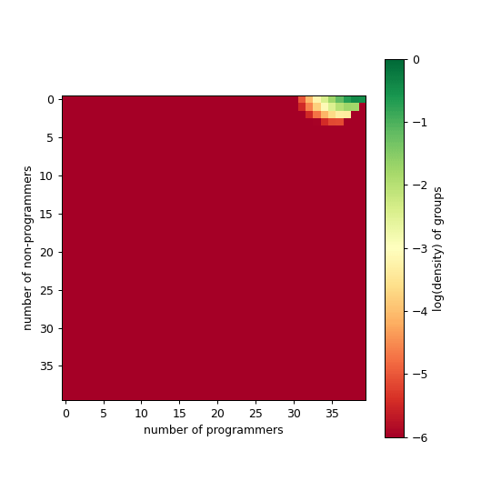
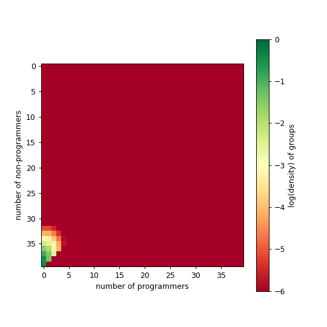
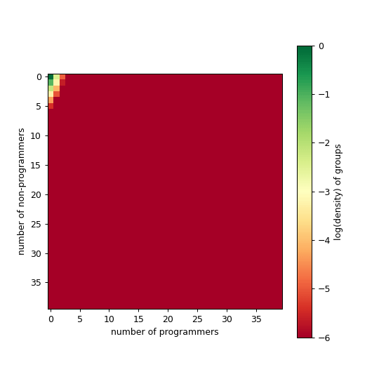

# Modeling Comp Transition

We first provide an overview of hysteresis in ecology, then we explain our group-based master equation model.

## Hysteresis in ecology

In ecology, alternative stable states are important because they can lead to drastic changes in the ecosystem even with small perturbations, which cannot be undone easily. 

The classical example is that of turbidity in shallow lakes, in response to excess level of nutrients (like phosphate). Something like

```tex
\dot{X} = \frac{a + X^2}{1+X^2} - rX
```

where _X_ is the ecosystem state (turbidity of the lake), while _r_ is the parameter condition (like nutrients). As you add more nutrients, nothing might happen for a while to the state of the lake. But as you hit a critical threshold, you bifurcate to a new fixed point of turbidity that is much higher than the previous one ('catastrophe' event). Unfortunately, as the story goes, to get get back to your favored equilibrium you need to remove much more nutrients from the lake than what has been allowed before. It might look like 


Try explaining that to farmers than the previous allowed level of nutrients is too much now.

This example has a a single parameter _r_. In the next example popularized by Strogatz, we have the outbreak of spruce budworms in forest, which the nondimensional version looks like

```tex
\dot{X} = rX(1 - \frac{X}{K}) - \frac{X^2}{1+X^2}
```

Here, the removal of the spruce budworms _X_ is a nonlinear term, wheras the growth rate takes a logistic form with growth rate _r_ and a carrying capacity _K_. For specific value of _K_ and _r_, we might have something like


Then, with some algebra, Strogatz show that we have hysteresis in this 2d systems 


To see how the pair of parameters _r_ and _k_ impact the ecosystem, you now need a 3d plot (plot borrowed from Garfinkel et al. 2021):


The management story here is that if you want to get from outbreak to refugee only, you could either drastically reduce _r_ (good luck with that) or perhaps reduce a little bit _k_ and _r_ (get into the bistable region, black star), then reduce _X_ (by spraying insecticides; white star). With this strategy, the system could go back by itself in the low-X equilibrium state (red star).

In both cases, we have a single state variable driven by one or more condition parameters. In the first case, the import of nutrients is nonlinear, with the removal being linear. In the second case, we end up with the removal being nonlinear (and not dependent on any parameter), while the reproduction rate is linear. 

In ecology, there are two ways by which alternative stable states are thought to happen; either by a shift in parameters shift, or in state variables.


The key differences are part of cultural differences in ecology:

- `community perspective`: shift in state variables (pushing a ball over a hill; landscape is broadly constant), e.g.
  - alternative interior states (predator removal or additions, Overharvesting a fishery)
  - boundary states where one or more species is absent (interspecific competition is stronger than intraspecific competition, one population will outcompete the other, Dispersal and colonization)
- `ecosystem perspective`: shift in parameters (changing the underlying landscape)


## GMEs hysteresis

We are interested in modeling the varying cost-benefit ratio of having programmers in research groups. Let ${tex`G_{n,p}`} be the fraction of groups with _n_ non-programmers and _p_ programmers. The idea is that we want to know under which conditions we can have bistable regime of groups with majority of programmers and non-programmers, in an shift environement (say, the humanities becoming more computational). We have the following model:

```tex
\begin{align*}
	\frac{d}{dt}G_{n,p} &= \mu G_{n+1,p} \cdot (n+p+1)(1-\frac{1+n+p}{k}) \\
                        &- \mu G_{n-1,p} \cdot (n+p+1)(1-\frac{1+n+p}{k}) \\
                        &+ \nu_n \Big((n+1)G_{n+1,p}-nG_{n,p}\Big) \\
	                    &+ \nu_p\Big((p+1)G_{n,p+1} - pG_{n,p} \Big) \\
						&+ \Big[ \tau_g(n+1,p-1)(1-c(n+1, p-1)G_{n+1,p-1} - \tau_g(n,p)G_{n,p} \Big] \\
	                    &+ \tau_g(n+1,p)(1-c(n+1,p))G_{n+1,p}
\end{align*}
```

where ${tex`n\nu_n`} and ${tex`p\nu_p`} are graduation rates of non-programmers and non-programmers. There is constant inflow of non-programmers in the system. 

Assuming  that learning to code confers a collective benefits on individuals ${tex`\tau_g(n,p; \alpha, \beta) \propto \frac{\bar{Z}_{n,p}}{Z_{n,p}}`}, where

```tex
\begin{align*}
\log(Z_{n,p}) &\sim \alpha n + \beta p \\
\log(\bar{Z}_{n,p}) &\sim \alpha (n-1) +\beta (c(n,p) p + (1-c(n,p))(p+1))
\end{align*}
```

In an increasingly data-driven world, individuals who learn to code are favored over non-programmers, that is ${tex`\beta >> \alpha`}.

```tex
\begin{align*}
\log\Big[\tau_g(n,p; \alpha, \beta))\Big] &= \alpha (n-1) +\beta (c(n,p) * p + (1-c)(p+1)) - \alpha n + \beta p \\
                                  &= -\alpha + \beta(1-c(n,p))
\end{align*}
```

##  Lab notes cost functions

We keep track of the different formulations of the cost functions below, from most recent to older entries. The current model can always be found [here](https://github.com/jstonge/modeling-comp-transition/blob/main/simulations/dyn_diff.hpp).

### 2024-10-03 [5cd819a](https://github.com/jstonge/modeling-comp-transition/blob/5cd819a74bb1d856cf904444e7e349c0652c399c/simulations/dyn_diff.hpp)

Currently, our cost function is defined as

```tex
c(n,p) = \frac{1}{1 + e^{k \cdot ( p/n - x_0)}}
```

we typically use the following values:

```js
function c(x,k,x0) {
    return 1 / (1 + Math.exp(k*( x - x0)))
}
```

```js
Plot.plot({
    nice: true,
    grid: true,
    caption: "(black) k=40, x0=0.25; (red) k=20, x0=0.25; (green) k=10, x0=0.25",
    x: {label:"p/n"},
    y: {label:"c(n,p)"},
    marks: [
        Plot.line(
            d3.range(0, 1, 0.01),
            { x: x => x, y: x => c(x, 40, 0.25) }
        ),
        Plot.line(
            d3.range(0, 1, 0.01),
            { x: x => x, y: x => c(x, 20, 0.25), stroke: "red" }
        ),
        Plot.line(
            d3.range(0, 1, 0.01),
            { x: x => x, y: x => c(x, 10, 0.25), stroke: "green" }
        )
    ]
})
```

With `k=40` and `k=20`, we see that a fraction of _p/n = 0_ it is impossible for non-programmers to convert into programmers. This is a bit intense. When the ratio is _0.25_, we see the sharpest decline in cost (something like 1 programmer in a group of 4). This is pretty arbitrary. With `k=40`, we observe a sharp decline, meaning that _40%_ of programmers in your team (regardless of size) is enough for anybody to successfully learn programming.


With a lower k value, we find that decrease in cost is less steep. At `k=10`, we get that _p/n = 0.5_ some people stil fail to learn to code, and not everybody fail  when there is no programmer around.

If we run the model, with the following set of parameters and the above cost function, for different initial conditions (with more or less programmers to start with, here we let run for 10 000 steps):

```
μ   νn   νp   α    β    k    x0   K  max1 max2 ic  is_temporal
0.1 0.01 0.03 0.01 0.1  40.0 0.25 40 40   40   $ic 1 
```

<div class="grid grid-cols-3">
    <div>
        
    </div>
    <div>
        
    </div>
    <div>
        
    </div>
</div>

note that we used ${tex`\beta=0.1`} and ${tex`\alpha=0.01`}, which means that the benefits of learning to code is 10x more than not learning to code (recall that relative fitness ${tex`\tau_g`} is in log space; this is a bit much). Note that when you start without any programmers, it stays that way. Say that I decrease `k=5`, we should see some more

```
μ   νn   νp   α    β    k    x0   K  max1 max2 ic  is_temporal
0.1 0.01 0.03 0.01 0.1  5.0 0.25 40 40   40   $ic 1 
```

<div class="grid grid-cols-3">
    <div>
        
    </div>
    <div>
        
    </div>
    <div>
        
    </div>
</div>

It is a bit better, but still have some really big groups. On average we always have above 30 people in the group.

### 2024-10-03 [5cd819a](https://github.com/jstonge/modeling-comp-transition/blob/5cd819a74bb1d856cf904444e7e349c0652c399c/simulations/dyn_diff.hpp)

Here we modify a bit the structure of the model. We will try adding some resource constraint on the growth of group size. The idea will be that not only there is a carrying capacity, but this capacity is limited by per-capita resources:

```tex
\mu \cdot G_{n-1,p} \cdot (p+n) \cdot \Big(1-\frac{r(n+p)}{R_{max}} \Big)
```

where ${tex`r(n+p) = r_0 \times (n + p)^2`}, and ${tex`R_{max}`} represents the total resources available (we hardcoded _r0=0.5_ and _Rmax=1000_ for now).

```
μ   νn   νp   α    β    k    x0   K  max1 max2 ic  is_temporal
0.1 0.01 0.03 0.01 0.1  5.0 0.25 40 40   40   $ic 1 
```

<div class="grid grid-cols-3">
    <div>
        
    </div>
    <div>
        
    </div>
    <div>
        
    </div>
</div>

### Previously on...


Here are few other things we've tried:

#### 1. ${tex`c(n,p) = e^{3p/n}`}

<details>
  <summary>result</summary>
    <div class="grid grid-cols-3">
        <div>
            
        </div>
        <div>
            
        </div>
        <div>
            
        </div>
    </div>

    μ   νn   νp   α    β    k    x0   K  max1 max2 ic  is_temporal
    0.1 0.01 0.03 0.01 0.1  20.0 0.25 20 40   40   $ic 1 
</details>

with some more we didn't put.

## More ideas

- For us, one idea would be that the landscape (institutions) are broadly constant, while one population (of programmers) could end up either displacing the other or could live in a bistable regime. This is another occasion to model timescale separation!
