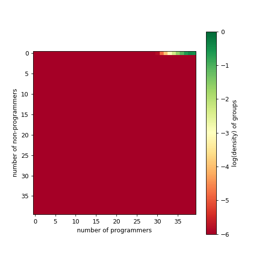

#  Lab notes 

Here we keep track of experiments.

## cost functions

We keep track of the different formulations of the cost functions below, from most recent to older entries. The current model can always be found [here](https://github.com/jstonge/modeling-comp-transition/blob/main/simulations/dyn_diff.hpp).

### 2024-10-04

<div class="grid grid-cols-3">
    <div>
        
    </div>
    <div>
        
    </div>
    <div>
        
    </div>
</div>


### 2024-10-03 [5cd819a](https://github.com/jstonge/modeling-comp-transition/blob/5cd819a74bb1d856cf904444e7e349c0652c399c/simulations/dyn_diff.hpp)

Currently, our cost function is defined as

```tex
c(n,p) = \frac{1}{1 + e^{k \cdot ( p/n - x_0)}}
```

we typically use the following values:

```js
function c(x,k,x0) {
    return 1 / (1 + Math.exp(k*( x - x0)))
}

function tau(a,b,x,k,x0) {
    return 1 / (1 + Math.exp(k*( x - x0)))
}
```

```js
Plot.plot({
    nice: true,
    grid: true,
    caption: "(black) k=40, x0=0.25; (red) k=20, x0=0.25; (green) k=10, x0=0.25",
    x: {label:"p/n"},
    y: {label:"c(n,p)"},
    marks: [
        Plot.line(
            d3.range(0, 1, 0.01),
            { x: x => x, y: x => c(x, 40, 0.25) }
        ),
        Plot.line(
            d3.range(0, 1, 0.01),
            { x: x => x, y: x => c(x, 20, 0.25), stroke: "red" }
        ),
        Plot.line(
            d3.range(0, 1, 0.01),
            { x: x => x, y: x => c(x, 10, 0.25), stroke: "green" }
        )
    ]
})
```

With `k=40` and `k=20`, we see that a fraction of _p/n = 0_ it is impossible for non-programmers to convert into programmers. This is a bit intense. When the ratio is _0.25_, we see the sharpest decline in cost (something like 1 programmer in a group of 4). This is pretty arbitrary. With `k=40`, we observe a sharp decline, meaning that _40%_ of programmers in your team (regardless of size) is enough for anybody to successfully learn programming.


With a lower k value, we find that decrease in cost is less steep. At `k=10`, we get that _p/n = 0.5_ some people stil fail to learn to code, and not everybody fail  when there is no programmer around.

If we run the model, with the following set of parameters and the above cost function, for different initial conditions (with more or less programmers to start with, here we let run for 10 000 steps):

```
μ   νn   νp   α    β    k    x0   K  max1 max2 ic  is_temporal
0.1 0.01 0.03 0.01 0.1  40.0 0.25 40 40   40   $ic 1 
```

<div class="grid grid-cols-3">
    <div>
        
    </div>
    <div>
        
    </div>
    <div>
        
    </div>
</div>

note that we used ${tex`\beta=0.1`} and ${tex`\alpha=0.01`}, which means that the benefits of learning to code is 10x more than not learning to code (recall that relative fitness ${tex`\tau_g`} is in log space; this is a bit much). Note that when you start without any programmers, it stays that way. Say that I decrease `k=5`, we should see some more

```
μ   νn   νp   α    β    k    x0   K  max1 max2 ic  is_temporal
0.1 0.01 0.03 0.01 0.1  5.0 0.25 40 40   40   $ic 1 
```

<div class="grid grid-cols-3">
    <div>
        
    </div>
    <div>
        
    </div>
    <div>
        
    </div>
</div>

It is a bit better, but still have some really big groups. On average we always have above 30 people in the group.

### 2024-10-03 [9193c2e](https://github.com/jstonge/modeling-comp-transition/blob/9193c2e8c3510b793d7d784a2ee74ea611b1beae/simulations/dyn_diff.hpp)

Here we modify a bit the structure of the model. We will try adding some resource constraint on the growth of group size. The idea will be that not only there is a carrying capacity, but this capacity is limited by per-capita resources:

```tex
\mu \cdot G_{n-1,p} \cdot (p+n) \cdot \Big(1-\frac{r(n+p)}{R_{max}} \Big)
```

where ${tex`r(n+p) = r_0 \times (n + p)^2`}, and ${tex`R_{max}`} represents the total resources available (we hardcoded ${tex`r_0=0.5`} and ${tex`R_{max}=1000`} for now).

```
μ   νn   νp   α    β    k    x0   K  max1 max2 ic  is_temporal
0.1 0.01 0.03 0.01 0.1  5.0 0.25 40 40   40   $ic 1 
```


<div class="grid grid-cols-3">
    <div>
        
    </div>
    <div>
        
    </div>
    <div>
        
    </div>
</div>

Ok, this is creating a wall at around 30 people, which is not that helpful. I guess that a more 'realistic' approach would be that ressources to grow depend on group fitness. In this case, we can try the following (disclaimer, this was done with a little bit of my friend `chatGPT`):

```tex
Z_{n,p} \sim \alpha n + \beta p - \frac{r(n+p)}{R(n,p)}
```

where ${tex`r(n+p)`}  is the resource cost for group of size _(n+p)_ and ${tex`R(n,p)=R_{max}\cdot F(n,p)`} is the resource availability. One option for the fitness function _F(n,p)_ is ${tex`F(n,p) = \frac{\beta p}{\alpha n + \beta p}`}.  Groups with more programmers have higher fitness, reflecting an increase in productivity (to see if programmers really are 'more productive'). Putting all of this together (with ${tex`r_0=0.5`} and ${tex`R_{max}=1000`})

```
μ   νn   νp   α    β    k    x0   K  max1 max2 ic  is_temporal
0.1 0.01 0.03 0.01 0.1  5.0 0.25 40 40   40   $ic 1 
```

<div class="grid grid-cols-3">
    <div>
        
    </div>
    <div>
        
    </div>
    <div>
        
    </div>
</div>

The model is becoming a big ungainly. We will stop here for today.


### Previously on...


Here are few other cost functions we've tried:

#### 1. ${tex`c(n,p) = e^{3p/n}`}

<details>
  <summary>result</summary>
    <div class="grid grid-cols-3">
        <div>
            
        </div>
        <div>
            
        </div>
        <div>
            
        </div>
    </div>

    μ   νn   νp   α    β    k    x0   K  max1 max2 ic  is_temporal
    0.1 0.01 0.03 0.01 0.1  20.0 0.25 20 40   40   $ic 1 
</details>

with some more we didn't put.
