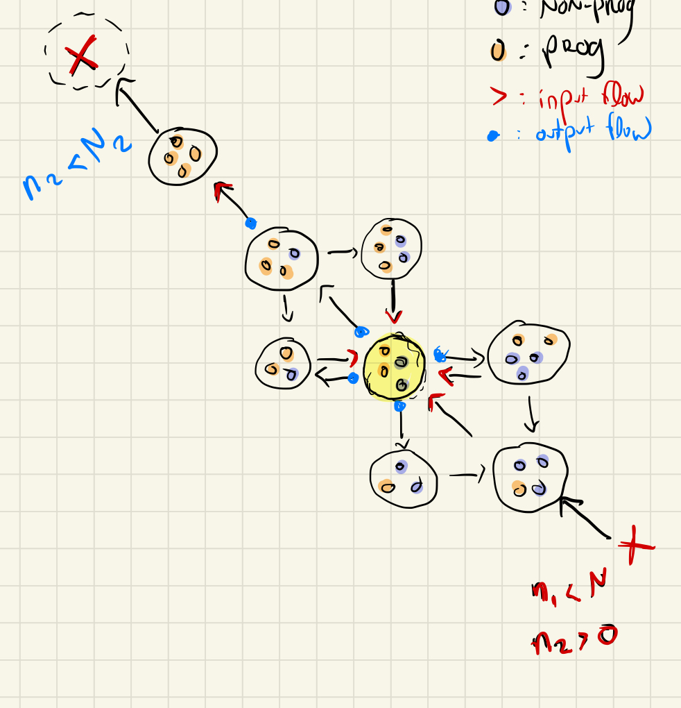

# The model



We are interested in modeling the varying cost-benefit ratio of having programmers in research groups. Let ${tex`G_{n,p}`} be the fraction of groups with _n_ non-programmers and _p_ programmers. The idea is that we want to know under which conditions we can have bistable regime of groups with majority of programmers and non-programmers, in an shift environement (say, the humanities becoming more computational). We have the following model:


```tex
\begin{align*}
    \frac{d}{dt}G_{n,p} &=  \mu G_{n-1,p} \cdot (n+p)(1-\frac{n+p}{k}) \\
                        &- mu G_{n,p} \cdot (n+p+1)(1-\frac{n+p+1}{k}) \\
                        &+ nu_n(n+1)G_{n+1,p} \\
                        &- n\nu_n G_{n,p} \\
                        &+ nu_p(p+1)G_{n,p+1} \\
                        &- p\nu_p G_{n,p} \\
                        &+ \frac{1}{1 + e^{-k(B(n+1,p-1)-C(n+1,p-1))}} \\
                        &- \frac{1}{1 + e^{-k(B(n,p)-C(n,p))}} \\
\end{align*}
 
\begin{align*}
    B(n,p) = \alpha \frac{1}{1 + e^{-k (\frac{p}{n} - x_0) }}

    C(n,p) = \frac{1}{1 + e^{k (\frac{p}{n} - x_0) }}
\end{align*}
```

---

#### old


```tex
\begin{align*}
    \frac{d}{dt}G_{n,p} &= \textcolor{red}{\mu G_{n-1,p} \cdot (n+p)(1-\frac{n+p}{k})}  \\
                        &- \textcolor{blue}{\mu G_{n,p} \cdot (n+p+1)(1-\frac{n+p+1}{k})} \\
                        &+ \textcolor{red}{\nu_n(n+1)G_{n+1,p}} \\
                        &- \textcolor{blue}{n\nu_n G_{n,p}} \\
                        &+ \textcolor{red}{\nu_p(p+1)G_{n,p+1}} \\
                        &- \textcolor{blue}{p\nu_p G_{n,p}} \\
                        &+ \textcolor{red}{\tau(\alpha, \beta, n+1, p-1)(n+1)(1 - c(n+1,p-1))*G_{n+1,p-1}} \\
                        &- \textcolor{blue}{\tau(\alpha, \beta, n, p)\cdot n\cdot (1-c(n,p))G_{n,p}} \\
                        &+ \textcolor{red}{\tau(\alpha, \beta, n+1, p) (n+1) c(n+1,p)G_{n+1,p}} \\
                        &- \textcolor{blue}{\tau(\alpha, \beta, n, p)\cdot n\cdot c(n,p)G_{n,p} }
\end{align*}
```

The color coding maps to the picture on the right. The output flow (probability of leaving a state) is in ${tex`\textcolor{blue}{blue}`}, while the input flow is in ${tex`\textcolor{red}{red}`}.  We highlight a state (${tex`G_{2,2}`}, or 2 non-programmers and 2 programmers) to facilitate the interpretation. The params are

| params | description | 
| ----   | -----      |
| ${tex`n\nu_n`} | graduation non-programmers | 
| ${tex`p\nu_p`} | graduation programmers | 
| ${tex`\mu`} | inflow non-programmers | 
| ${tex`K`} | group carrying capacity | 
| ${tex`\alpha`} | benefit non-programmers | 
| ${tex`\beta`} | benefit programmers | 

| function | form | description |
| ----   | -----      |        ----         |
| ${tex`\tau_g(n,p)`} | ${tex`-\alpha + \beta(1-c(n,p))`} |            |
| ${tex`c(n,p)`} | ${tex`\frac{1}{1 + e^{k*(p/n - x_0)}}`} |                    |

We explore our different functions in the following subsections

#### Group benefits of coding

Learning to code confers a collective benefits on individuals ${tex`\tau(n,p) \propto \bar{Z}_{n,p}Z_{n,p}^{-1}`}. We define the current benefit to be 

```tex
\log(Z_{n,p}) \sim \alpha n + \beta p
```

while the potential benefit is 

```tex
\begin{align*}
\log(\bar{Z}_{n,p}) &\sim \alpha (n-1) \\
                    &+ \beta ( c(n,p) \cdot p + ( 1 - c(n,p) )\cdot(p+1))
\end{align*}
```

where ${tex`c(n,p) \cdot p`} is the cost of failing (you don't get an additional programmer) and ${tex`1 - c(n,p) \cdot (p+1)`} is the successful transition, both of which are weighted by ${tex`\beta`}, the benefit of becoming a programmer.  In an increasingly data-driven world, individuals who learn to code are favored over non-programmers, that is ${tex`\beta >> \alpha`}.  Reorgniaizing the term, we get:

```tex
\begin{align*}
\log\Big[\tau_g(n,p; \alpha, \beta))\Big] &= \alpha (n-1) +\beta (c(n,p) \cdot p + (1-c)(p+1)) - \alpha n + \beta p \\
                                          &= -\alpha + \beta(1-c(n,p))
\end{align*}
```

#### Cost function

We assume that the group benefits are balanced by an individual cost of learning to code. Currently, our cost function is a function of the fraction of programmers to non-programmers in the group. It takes the following (logistic) form:

```tex
c(n,p) = \frac{1}{1 + e^{k \cdot ( p/n - x_0)}}
```

In the picture above, we see that the upper-left diagonal indicates successful transition, which happens at a rate ${tex`\tau(\alpha, \beta, n, p) \cdot (1 - c(n,p))\cdot n`}. The incoming input flow is proportional to ${tex`G_{3,1}`}, while the output flow is always proportional to current state.

```js
const k = view(Inputs.range([5,40], {label: "k", step:1, value: 20}))
const α = view(Inputs.range([0.001, 0.11], {label: "α (non-prog benefit)", step:0.01, value: 0.01}))
const β = view(Inputs.range([0.001, 0.11], {label: "β (prog benefit)", step:0.01, value: 0.1}))
```
<div class="grid grid-cols-2">
    <div>
    ${resize((width) => Plot.plot({
        title: "cost", nice: true, grid: true, width,
        x: {label:"p/n"}, y: {label:"c(n,p)"},
        marks: [
            Plot.line( d3.range(0, 1, 0.01), { 
                x: x => x, y: x => c(x, k, 0.25), stroke:"blue" 
                }
            )
        ]
    }))}
    </div>
    <div>
    ${resize((width) => Plot.plot({
        title: "group benefit", nice: true, grid: true, width,
        x: {label:"p/n"}, y: {label:"τ(n,p)"},
        marks: [
            Plot.line( d3.range(0, 1, 0.01), { 
                x: x => x, y: x => -α + β*(1-c(x, k, 0.25)), stroke:"red" 
                }
            )
        ]
    }))}
    </div>
</div>

```js
Inputs.table(d3.range(0, 1, 0.01).map((x,i) => {
    return [i, c(x, k, 0.25), -α + β*(1-c(x, k, 0.25))]}), {
        header: ["timestep", "c(x)", "τ(x)"], width: 600
    })
```

```js
function c(x,k,x0) {
    return 1 / (1 + Math.exp(k*( x - x0)))
}

function tau(a,b,x,k,x0) {
    return 1 / (1 + Math.exp(k*( x - x0)))
}
```